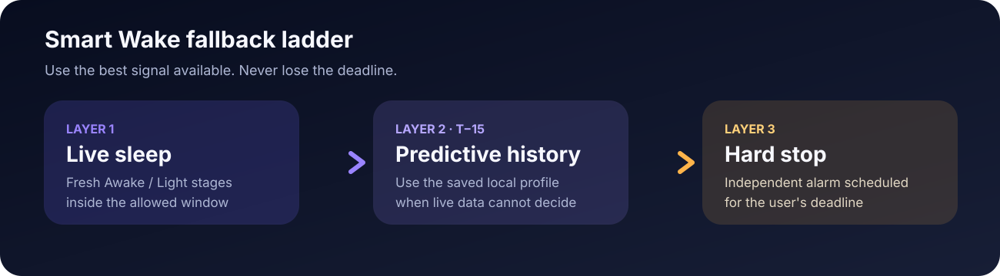
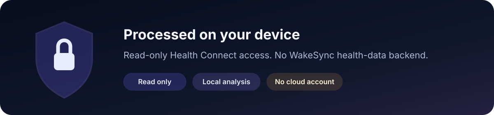

<p align="center">
  
</p>

<p align="center">
  <a href="https://github.com/kiranoommen/WakeSync/actions/workflows/android.yml"></a>
  
  
  
  
</p>

<p align="center">
  <strong>Better mornings, in sync with you.</strong><br />
  Private Android smart alarm using Health Connect, on-device prediction, and a guaranteed hard wake deadline.
</p>

<p align="center">
  <a href="docs/README.md"><strong>Explore the docs</strong></a> ·
  <a href="docs/BRANDING.md">Brand</a> ·
  <a href="docs/ARCHITECTURE.md">Architecture</a> ·
  <a href="docs/TESTING.md">Testing</a> ·
  <a href="docs/PRIVACY.md">Privacy</a>
</p>

> Current status: early development / real-device validation. The alarm fallback architecture is implemented, but live overnight wearable sync still needs repeated real-world testing.

## 🌅 How Smart Wake works

<p align="center">
  
</p>

WakeSync now has two alarm modes:

- **Smart Wake** — live sleep stage → saved historical fallback → guaranteed hard stop.
- **Standard Alarm** — one exact alarm time with no Health Connect or sleep monitoring required.

For a wake range of **6:20–7:00 AM**:

| Time | WakeSync behavior |
| --- | --- |
| 6:05 AM | Begin monitoring Health Connect, 15 minutes before the range |
| 6:20 AM | Earliest allowed wake |
| 6:20–7:00 AM | Fresh Awake or Light sleep can trigger the alarm while live monitoring stays active |
| 6:50–7:00 AM | A saved-history fallback may fire if live sleep has not already woken you |
| 7:00 AM | Independent hard-stop alarm fires regardless |

WakeSync never intentionally wakes before the user's earliest time. The hard-stop alarm is scheduled independently so live data and prediction are not the only paths to waking the user.

## 🌙 Live data rules

WakeSync only treats a Health Connect sleep stage as live when it is:

- still ongoing; or
- no more than five minutes old.

If the wearable or sleep app has not synced fresh data, WakeSync does not pretend it knows the current stage. It falls through to historical prediction and then the hard stop.

## 🧠 Historical prediction

WakeSync derives a compact local profile from up to 30 recent sleep sessions.

For each minute near the historical end of sleep, the profile stores:
- average wake suitability;
- sample count.

The historical fallback is limited to the final 10 minutes before the deadline and requires enough historical evidence before using a candidate. Weak or missing history is ignored.

Raw sleep records are read from Health Connect as needed rather than duplicated into a WakeSync backend.

## ✨ Current capabilities

- Android Health Connect sleep reads
- read-only sleep-stage access
- background Health Connect reads when supported
- multiple recurring alarm schedules with weekday selection and skip-next controls
- each alarm independently selects Smart Wake or Standard Alarm
- Smart Wake uses a user-controlled early window before its hard deadline
- live Awake / Light wake logic
- historical fallback limited to the final 10 minutes while live monitoring remains active
- independent hard-stop alarm
- exact alarm scheduling
- full-screen alarm handling
- four-tab Home / Alarms / Sleep / Settings interface with swipe navigation
- redesigned full-screen ringing UI with per-alarm label, mode/reason context, and snooze
- alarm sound and vibration
- reboot, clock-change, and timezone-change schedule restoration
- local wake settings and derived history
- sleep analytics dashboard and richer sleep log
- optional HRV and resting-heart-rate context
- optional extended Health Connect history
- local CSV, PDF, and shareable story exports
- onboarding plus light/dark/system themes
- Android CI build

## 📱 Android requirements

Smart Wake needs:

- Android device with Health Connect support;
- sleep-stage data written into Health Connect by a compatible source;
- read-only sleep access;
- background-read access where supported;
- exact-alarm access;
- notifications;
- full-screen alarm access on Android 14+.

## ⚠️ Important limitation

WakeSync controls **when it reads Health Connect**, not **when a wearable writes data into Health Connect**.

Fitbit, Samsung Health, or another source may sync:
- during sleep;
- in batches;
- only after the sleep session ends.

That behavior determines whether the live layer can be useful on a given device/source. WakeSync is designed to degrade safely to prediction and the hard stop when live data is unavailable.

## 🔒 Privacy

<p align="center">
  
</p>

WakeSync is designed around on-device processing.

- Health Connect access is read-only.
- Sleep analysis stays on the device.
- WakeSync does not require a cloud account or health-data backend.
- Derived wake history is stored locally.
- Raw personal sleep records should never be committed to this repository.

See [Privacy model](docs/PRIVACY.md).

## 🛠️ Build

Requirements:

- JDK 17
- Android SDK API 36
- Gradle compatible with the Android Gradle Plugin configured by the project

Build the debug APK:

```bash
gradle :app:assembleDebug
```

## 📚 Documentation

Start with the **[visual documentation hub](docs/README.md)**.

- [Brand guide](docs/BRANDING.md)
- [Design system](docs/DESIGN_SYSTEM.md)
- [Architecture](docs/ARCHITECTURE.md)
- [Wake algorithm](docs/WAKE_WINDOW_ALGORITHM.md)
- [Testing plan](docs/TESTING.md)
- [Sleep metrics & scoring](docs/SLEEP_METRICS.md)
- [Privacy model](docs/PRIVACY.md)
- [MVP roadmap](docs/MVP_ROADMAP.md)
- [Changelog](CHANGELOG.md)
- [Contributing](CONTRIBUTING.md)
- [Security](SECURITY.md)

## 🎯 Project priorities

The next major validation work is not adding more prediction complexity. It is proving the real overnight data path:

1. verify how frequently Fitbit-originated sleep stages appear in Health Connect during sleep;
2. measure freshness at the start of the wake window;
3. validate exact-alarm behavior on real Android devices;
4. test OEM battery-management edge cases;
5. refine confidence and feedback only after those fundamentals are reliable.

## 🧭 Product claim boundary

WakeSync uses consumer sleep-stage data as an alarm scheduling signal.

It does **not** claim to:
- directly measure cortisol;
- diagnose sleep disorders;
- provide clinical-grade sleep staging;
- identify a biologically perfect wake time.

## 🤝 Contributing

See [CONTRIBUTING.md](CONTRIBUTING.md). Alarm-path changes must preserve the independent hard-stop behavior and pass CI.

## 📄 License

No open-source license has been selected for WakeSync yet.
