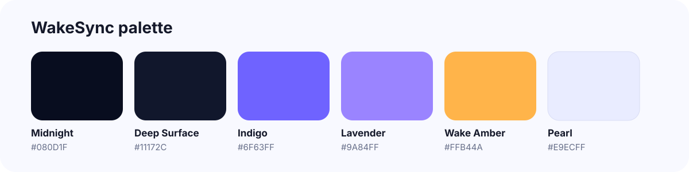

  

# WakeSync Documentation

  <strong>Product, engineering, design, privacy, and validation docs for WakeSync.</strong>

  <a href="../README.md">← Repository home</a>

## Explore

| | Document | What it covers |
| --- | --- | --- |
| 🎨 | **[Brand guide](BRANDING.md)** | Identity, voice, colors, logo usage, product claims, imagery |
| ✨ | **[Design system](DESIGN_SYSTEM.md)** | UI tokens, components, motion, accessibility |
| 🧭 | **[Architecture](ARCHITECTURE.md)** | Android stack, alarm layers, Health Connect flow |
| ⏰ | **[Wake algorithm](WAKE_WINDOW_ALGORITHM.md)** | Live → predictive → hard-stop decision logic |
| 🧪 | **[Testing plan](TESTING.md)** | Manual matrix, overnight validation, reliability checks |
| 🔒 | **[Privacy model](PRIVACY.md)** | On-device processing and Health Connect boundaries |
| 🗺️ | **[MVP roadmap](MVP_ROADMAP.md)** | Delivered milestones and next priorities |

## The product in one picture

  

## Brand at a glance

  

WakeSync is intentionally built around a simple contract: use the best sleep signal available **inside the user's chosen wake range**, while preserving an independent hard deadline.

## Engineering priority

The project is currently in **real-device validation**. The key question is not whether more prediction logic can be added; it is whether live wearable sleep stages arrive in Health Connect with enough freshness and consistency to improve real mornings.

---

  🌙 <strong>WakeSync</strong> · Better mornings, in sync with you.

